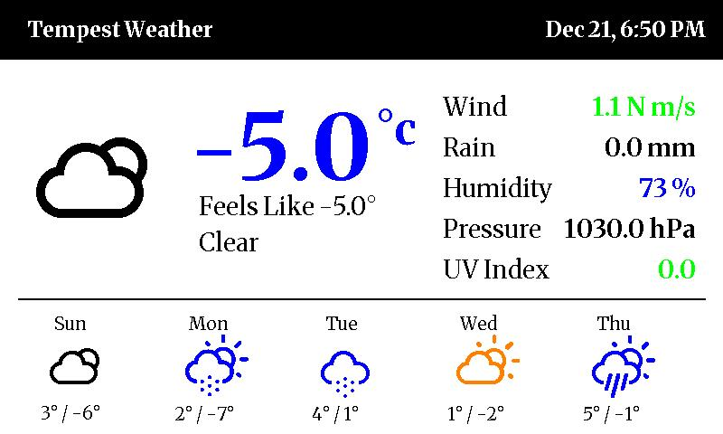

# Tempest Inky Dashboard 🌩️

A clean, high-contrast weather dashboard for the [Pimoroni Inky Impression 7.3"](https://shop.pimoroni.com/products/inky-impression-7-3) powered by a [Tempest Weather System](https://weatherflow.com/tempest-weather-system/).



## The Story
I have dreamed of building a custom weather display like this for years, but I never felt I had the technical ability to pull it off. This project was "vibe coded" with the help of **Google Gemini** acting as my pair programmer.

It is a passion project, built by a hobbyist for hobbyists. I welcome any suggestions, forks, or pull requests from those who really know what they are doing to help make the code cleaner and better!

## Features
* **Crisp E-Paper Design:** Uses the **Merriweather** Serif font for a classic "newspaper" aesthetic that looks great on e-ink.
* **Smart Colors:** Logic-based coloring (Green/Orange/Red) for temperature, wind, and UV comfort levels based on hardware capabilities.
* **Forecast Integration:** 5-Day forecast row populated by the Tempest "Better Forecast" API.
* **Reliable:** Auto-recovers from network issues and runs automatically via cron.

## Hardware Required
* **Raspberry Pi:** Works on Zero 2 W, 3, 4, or 5.
* **Display:** [Pimoroni Inky Impression 7.3"](https://shop.pimoroni.com/products/inky-impression-7-3) (7-color e-paper).
* **Weather Station:** [Tempest Weather System](https://weatherflow.com/tempest-weather-system/).

## Installation (Fresh Install)

These instructions assume you are starting with a fresh Raspberry Pi OS (Bookworm or newer) image.

## Credits & Licenses
This is a non-commercial passion project built by a hobbyist, for hobbyists. I welcome suggestions and improvements!

All data and assets belong to their respective creators:

* **Weather Data:** Powered by the [Tempest API](https://weatherflow.github.io/Tempest/api/).
* **Icons:** [Weather Icons](https://erikflowers.github.io/weather-icons/) by Erik Flowers (Licensed under SIL OFL 1.1).
* **Typography:** [Merriweather](https://fonts.google.com/specimen/Merriweather) by Sorkin Type (Licensed under SIL OFL 1.1).
* **Hardware Library:** [Inky](https://github.com/pimoroni/inky) by Pimoroni.

### Prerequisite: Remote Access
I highly recommend installing [Tailscale](https://tailscale.com) on your Pi for easy, secure SSH access from anywhere without opening ports.
```bash
curl -fsSL [https://tailscale.com/install.sh](https://tailscale.com/install.sh) | sh
sudo tailscale up --ssh

