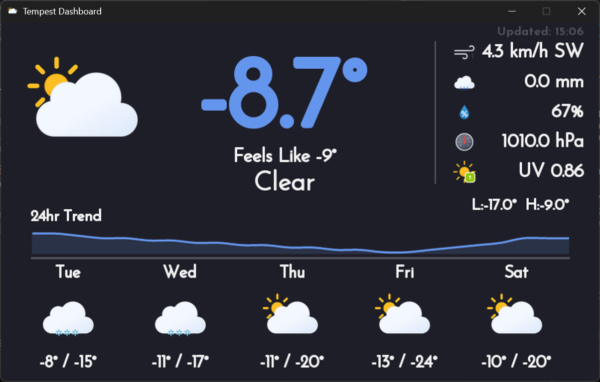

# Tempest Weather Dashboard 🌩️

A rich, high-contrast weather dashboard that adapts to its environment. It powers a hardware **E-Ink Display** on Raspberry Pi and runs as a beautiful **Desktop App** on Windows.

Powered by the [Tempest Weather System](https://weatherflow.com/tempest-weather-system/).

<p align="center">
  
  
</p>

## The Story
I have dreamed of building a custom weather display for years. This project was "vibe coded" with the help of Google Gemini acting as my pair programmer. It started as a dedicated hardware project for a Raspberry Pi but has evolved into a cross-platform dashboard that shares a single drawing engine.

## Features
### 🎨 Dual Rendering Engine
The code detects where it is running and adapts the visual style automatically:
* **E-Ink Mode (Raspberry Pi):** Uses a "Vivid Bar" graph style with pure hardware pigments (Blue/Green/Orange/Red) to avoid dithering artifacts. High-contrast white background for readability.
* **Desktop Mode (Windows):** Switches to a "Dark Mode" aesthetic with a **Cubic Spline Smoothed Graph** and beautiful alpha-blended gradient fills.

### 📊 Rich Data
* **Dynamic Trend Graph:** Visualizes the 24-hour temperature trend (cooling vs. warming).
* **Smart Coloring:** Temperature values change color dynamically (Freezing, Cold, Cool, Mild, Warm, Hot).
* **Full Stats:** Feels Like, Wind Speed (km/h) & Direction, Rain Accumulation, Humidity, Pressure, and UV Index.
* **5-Day Forecast:** Populated by the Tempest "Better Forecast" API.

## Hardware Mode (Raspberry Pi)
### Requirements
* **Raspberry Pi:** Zero 2 W, 3, 4, or 5.
* **Display:** [Pimoroni Inky Impression 7.3"](https://shop.pimoroni.com/products/inky-impression-7-3) (7-color e-paper).

### Installation
1.  Clone the repo:
    ```bash
    git clone [https://github.com/moorew/tempest-inky.git](https://github.com/moorew/tempest-inky.git)
    cd tempest-inky
    ```
2.  Run the installer (sets up venv, installs dependencies):
    ```bash
    chmod +x install.sh
    ./install.sh
    ```
3.  Add your API keys to `secrets.py`.

## Desktop Mode (Windows)
You can run this dashboard right on your PC without any specialized hardware.

### Running from Source
1.  Install Python 3.
2.  Install dependencies:
    ```powershell
    pip install requests pillow customtkinter
    ```
3.  Run the app:
    ```powershell
    python desktop.py
    ```

### Building the EXE (for distribution)
If you want to create a standalone `.exe` or installer:
1.  Install the build tools:
    ```powershell
    pip install pyinstaller
    ```
2.  Run the build command (bundles all assets and icons):
    ```powershell
    pyinstaller --noconsole --onefile --icon="assets/icon.ico" --add-data "assets;assets" --add-data "secrets.py;." desktop.py
    ```
3.  Your app will appear in the `dist/` folder.

## Configuration
**You must add your Tempest credentials for the dashboard to work.**

1.  **Station ID:** Find this on the Tempest website (Settings > Stations > public-url-id).
2.  **API Token:** Generate a Personal Use Token at Tempest Settings > Data Authorizations.
3.  Create a file named `secrets.py` in the root folder:
    ```python
    STATION_ID = "12345"
    TOKEN = "your-long-token-string"
    ```

## Credits & Licenses
This is a non-commercial passion project built by a hobbyist, for hobbyists.

* **Weather Data:** Powered by the [Tempest API](https://weatherflow.github.io/Tempest/api/).
* **Hardware Library:** [Inky](https://github.com/pimoroni/inky) by Pimoroni.
* **UI Library:** [CustomTkinter](https://github.com/TomSchimansky/CustomTkinter).
* **Icon set (with e-ink design updates):** [Meteocons by Bas.dev](https://bas.dev/work/meteocons).