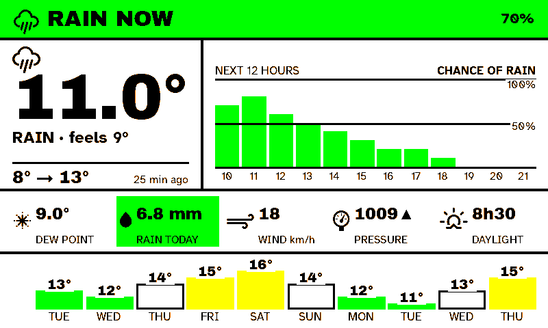

# Tempest Inky

A Python application for the Raspberry Pi that displays a weather dashboard on a Pimoroni Inky e-ink display, pulling live data directly from a WeatherFlow Tempest weather station.

The layout is built to be read from a sofa, about 4.5 m away, in a dim room. Type is sized by viewing distance — comfortable reading needs a cap height of roughly distance ÷ 200 — and at that distance only one text element can ever be legible. So the panel carries exactly two things across the room: a number and a shape. Everything else is sized for walk-up.

Colour is fill, never type, and each ink does at most two jobs. The left column's field carries official alert severity and nothing else; the forecast bars carry absolute temperature and nothing else. Condition is carried by glyphs and has no ink of its own, so a mild, quiet week renders almost entirely black and white — and colour appearing across the room always means something changed.



*Illustrative render. The panel shows your own station's data.*

---

## What's on the display

Two columns split by a rule at x=362, with fixed geometry — nothing moves between refreshes, which is what keeps an e-ink panel from ghosting and means the number you want is always where you last found it.

| Zone | Contents |
|------|----------|
| **NOW** (362 × 480, left) | The condition as a 100 px glyph, the temperature at 172 px in whole degrees, and below a rule, the feels-like and today's high and low on a shared label column. Fills with the alert colour when a government warning is active — a field of ink has no legibility threshold at all, so it registers from anywhere in the room. |
| **METRICS** (168 px) | Wind, rain, pressure and daylight in a 2×2 grid — always these four, always in this order, each carrying its unit in the label so the value stays as large as the cell allows. A metric with no data shows a dash rather than disappearing. |
| **NEXT** (160 px) | The single highest-priority thing worth knowing — an official alert, lightning, rain starting, gusts, frost, or station trouble — in sentence case, over a sub-line of qualifying figures, over the next four hours. Reads `All clear today` when all is quiet, and keeps its height either way. The exact temperature lives on the sub-line, since the hero rounds. |
| **LATER** (152 px) | Five days: name, condition glyph, a 12 px temperature bar and the high. Bar *length* is relative to that week's own range, so it shows the week's shape; bar *fill* is absolute — blue below 0 °C, green to 9, white to 19, then yellow, orange and red — so it shows the week's level. There is no key: the high is printed beside every bar, so the panel teaches its own scale. |

Times are always absolute. The panel can be 15 minutes stale, so "in 3h 25m" is wrong for 14 of every 15 minutes; `18:00` never is.

---

## Weather alerts

The panel can carry official government warnings. The Tempest API does not have them — alerting is a TempestOne feature, not part of the public API — so this is one extra request to a national weather service. It is entirely optional and off unless a feed is available for your location.

When an alert is active the whole 800×210 hero fills with its severity colour, and the headline band shows the event name and when it expires.

| Level | Colour | Meaning |
|-------|--------|---------|
| Advisory | Yellow | Be aware |
| Watch | Orange | Be prepared |
| Warning | Red | Take action |

All three services speak CAP, so severity maps the same way everywhere: Minor → advisory, Moderate → watch, Severe/Extreme → warning.

### Setting it up

**Most people need to do nothing.** The panel reads your station's coordinates and timezone from the Tempest API and picks the right national feed by itself. Check what it resolved to:

```bash
cd ~/tempest-inky
venv/bin/python3 main.py --check-alerts
```

```
  Coordinates : 43.6532, -79.3832
  Timezone    : America/Toronto
  Region      : ca (auto-detected)

No alert active for this location right now.
```

That is a working setup — `Region: ca` means the feed is wired up and there is simply nothing to warn about. If it prints `Region: none`, or the wrong country, follow the steps for your region below.

All settings go in `~/secrets.py`, alongside your station ID and token. Restart nothing — the next refresh picks them up.

#### 🇨🇦 Canada — Environment Canada

Source: the MSC GeoMet weather-alerts collection. No key, no account, no rate limit to worry about. Alerts are matched to your station's exact coordinates, and Environment Canada's own advisory / watch / warning levels map straight onto the three colours.

```python
ALERT_REGION = "ca"
```

Only needed if auto-detection failed — which happens if your station is close enough to the border that coordinates alone are ambiguous. See *Near the border* below.

#### 🇺🇸 United States — National Weather Service

Source: `api.weather.gov/alerts/active`. No key, no account. Alerts are matched to your station's exact coordinates and use CAP severity directly.

```python
ALERT_REGION = "us"
```

#### 🇬🇧 United Kingdom — Met Office

Source: the Met Office public warnings feed. No key, no account. This one **does** need a setting: the Met Office publishes warnings by region rather than by point, so you have to say which region you are in.

```python
ALERT_REGION = "uk"
ALERT_AREA = "wl"        # your region code from the table below
```

| Code | Region | Code | Region |
|------|--------|------|--------|
| `uk` | UK — everything, national feed | `wl` | Wales |
| `ni` | Northern Ireland | `sw` | South West England |
| `os` | Orkney & Shetland | `se` | London & South East England |
| `he` | Highlands & Eilean Siar | `ee` | East of England |
| `gr` | Grampian | `em` | East Midlands |
| `ta` | Central, Tayside & Fife | `wm` | West Midlands |
| `st` | Strathclyde | `yh` | Yorkshire & Humber |
| `dg` | Dumfries, Galloway, Lothian & Borders | `nw` | North West England |
| | | `ne` | North East England |

Leaving `ALERT_AREA` unset uses the national `uk` feed, which will show you warnings for anywhere in the country — fine if you want the national picture, noisy if you don't. Pick your own region for a panel that only lights up when it concerns you.

Verify with `venv/bin/python3 main.py --check-alerts`, which prints the region it resolved and names it back to you:

```
  Region      : uk (configured)
  Met Office  : wl — Wales
```

#### Anywhere else

There is no feed, and `--check-alerts` will say so. The panel works exactly as it does with no alert active — you simply never get a beacon. To silence the auto-detection message:

```python
ALERT_REGION = "none"
```

### Other settings

```python
LATITUDE = 43.6532       # only if the panel is not where the station is
LONGITUDE = -79.3832
```

Set these if the alert location should differ from the station's own coordinates. Both must be set together. They can also be given as environment variables — `TEMPEST_ALERT_REGION`, `TEMPEST_ALERT_AREA`, `TEMPEST_LAT`, `TEMPEST_LON` — which take precedence over `~/secrets.py`.

### Near the border

If your station is anywhere in the wide band where the Canadian and US bounding boxes overlap — Toronto is further south than Minneapolis — the panel will **not** guess a country from coordinates alone, because serving the wrong country's warnings is worse than serving none. It normally resolves this from your station's timezone. If it can't, `--check-alerts` prints:

```
Station sits in the Canada/US border band — set ALERT_REGION to ca or us.
```

Set `ALERT_REGION` explicitly and it is settled.

### When the feed fails

A failed alert fetch is always treated as "no alert", never as an error. The feed is a second network dependency and is never allowed to take the weather display down with it — if the alert service is unreachable you still get your weather.

The last alert is cached in `~/.tempest-alert.json` with its expiry, so a brief outage doesn't drop a warning off the panel mid-storm, and the cache is discarded once the alert expires. The cache is keyed to the feed it came from, so changing `ALERT_REGION` never resurfaces the previous region's alerts.

---

## Hardware

| Component | Details |
|-----------|---------|
| Pi | Raspberry Pi Zero 2 W (or any Pi with 40-pin header) |
| Display | Pimoroni Inky Impression 7.3" (800×480, 7-colour) |
| OS | Raspberry Pi OS Lite — Bookworm (64-bit recommended) |

---

## Pre-install: Setting up a fresh headless Pi

These steps are done on your laptop/desktop before you touch the Pi.

### 1. Flash the SD card

Use the [Raspberry Pi Imager](https://www.raspberrypi.com/software/). Choose:
- **OS**: Raspberry Pi OS Lite (64-bit) — Bookworm
- **Storage**: your SD card (16 GB minimum; use a reputable brand — SanDisk or Samsung)

Before writing, click the **gear icon** (Advanced Options) and configure:
- ✅ Enable SSH (password authentication)
- ✅ Set username and password
- ✅ Configure WiFi (SSID + password)
- ✅ Set locale / timezone

Write the image to the SD card.

### 2. First boot

Insert the card into the Pi, attach the Inky display, and power on. Wait ~60 seconds, then SSH in:

```bash
ssh yourname@raspberrypi.local
# or use the IP address shown in your router's device list
```

### 3. Update the system

```bash
sudo apt update && sudo apt full-upgrade -y
sudo reboot
```

Wait for the Pi to reboot, then SSH back in before continuing.

> **Note:** Always update before installing. It avoids broken package dependencies and ensures you have the latest kernel/firmware for the Inky SPI driver.

---

## Installation

### 1. Install git (not pre-installed on Pi OS Lite)

```bash
sudo apt install -y git
```

### 2. Clone the repository

```bash
git clone https://github.com/moorew/tempest-inky.git
cd tempest-inky
```

### 3. Get your Tempest credentials

You need:
- **Station ID** — visible in the WeatherFlow app under *Settings → Stations*
- **Personal Use Token** — generate one at [tempestwx.com/account/tokens](https://tempestwx.com/account/tokens)

### 4. Run the installer

```bash
bash install.sh
```

The installer will:
- Install system dependencies
- Enable SPI and I2C hardware interfaces
- Ensure your user is in the `spi`, `i2c`, and `gpio` groups
- Apply the Bookworm SPI chip-select overlay fix
- Create a self-contained Python virtual environment
- Prompt you for your Station ID and API token, saved as `~/secrets.py`
- Install a **systemd timer** that refreshes the display on an adaptive schedule

### 5. Reboot

```bash
sudo reboot
```

The display will update automatically ~2 minutes after boot, then every 15 minutes — more often when rain is likely within the hour, less often overnight.

---

## How it works

| Feature | Detail |
|---------|--------|
| **Refresh schedule** | Adaptive: every 15 min normally, 10 min when rain is likely in the next hour, 30 min overnight (22:00–06:00). The timer ticks every 5 min and `main.py` decides whether a tick is due. |
| **Stale data** | If a fetch fails, the last good reading is redrawn with a `STALE` marker instead of wiping the panel |
| **Weather alerts** | One extra request to Environment Canada, the NWS or the Met Office, picked from your station's location. A failure here is always "no alert" and never affects the weather |
| **Virtual environment** | Self-contained; immune to system Python upgrades |
| **Network resilience** | Waits up to 2 minutes for WiFi before fetching |
| **API retry** | Up to 3 attempts with exponential backoff on failure |
| **Logging** | systemd journal (RAM-backed; no extra SD card wear) |
| **Hang protection** | systemd kills the process after 5 minutes |
| **Type** | Jost 300/400/600 and Weather Icons, both SIL OFL and committed to `assets/`. Figures are tabular, so values do not shuffle sideways between refreshes |

---

## Managing the service

```bash
# Check whether the timer is running
systemctl status tempest-inky.timer

# See recent logs (most useful for debugging)
journalctl -u tempest-inky.service -n 50

# Force an immediate refresh
sudo systemctl start tempest-inky.service

# Stop automatic refreshes
sudo systemctl stop tempest-inky.timer

# Re-enable after stopping
sudo systemctl start tempest-inky.timer
```

---

## Troubleshooting

### Display never updates after install

1. Check that you rebooted after installation.
2. Check logs: `journalctl -u tempest-inky.service -n 50`
3. Try a manual run to see errors directly:
   ```bash
   cd ~/tempest-inky
   sudo systemctl start tempest-inky.service
   journalctl -u tempest-inky.service -n 20
   ```

### "No module named inky" or import errors

The virtual environment may be corrupted (common after a system Python upgrade). Re-run the installer — it rebuilds the venv cleanly:

```bash
cd ~/tempest-inky
bash install.sh
```

### Display shows "DATA FETCH ERROR"

This appears only when a fetch fails **and** there is no cached reading to fall back on — normally a failed fetch redraws the last good data with a `STALE` marker instead. Your API credentials may be wrong, or the Pi has no internet. Check:
```bash
# Test connectivity
curl -s "https://swd.weatherflow.com/swd/rest/observations/station/YOUR_ID?token=YOUR_TOKEN" | python3 -m json.tool | head -20

# Check secrets file
cat ~/secrets.py
```

### Alerts never appear

The alert feed is deliberately silent — every failure is treated as "no alert" so it can never take the weather down with it — so the way to tell "nothing is happening" from "nothing is wired up" is to ask:

```bash
cd ~/tempest-inky
venv/bin/python3 main.py --check-alerts
```

| It says | What to do |
|---------|------------|
| `Region: ca` / `us` / `uk` and no alert | Working. There is nothing to warn about right now. |
| `Region: none` | No feed for your location, or auto-detection failed — set `ALERT_REGION` in `~/secrets.py`. |
| `Station sits in the Canada/US border band` | Set `ALERT_REGION = "ca"` or `"us"` explicitly. |
| `UNKNOWN REGION CODE` | Your `ALERT_AREA` is not a Met Office region — pick one from the table in [Weather alerts](#weather-alerts). |
| `Alert fetch failed` | The national service is unreachable or down. The weather panel is unaffected; it will retry on the next refresh. |

Remember that the beacon only fires for **official government alerts**, never for ordinary conditions — a thunderstorm with no warning issued against it leaves the hero white.

### SPI / display not detected

Verify SPI is enabled:
```bash
ls /dev/spidev*   # should show /dev/spidev0.0
```

If missing, run `sudo raspi-config` → Interface Options → SPI → Enable, then reboot.

### Works fine but stops after a few months

The most common cause is SD card corruption from power loss, or sectors wearing out on a low-quality card. Recommendations:
- Use a **name-brand SD card** (Samsung PRO Endurance or SanDisk High Endurance are designed for constant-write workloads like this)
- **Avoid powering off the Pi by unplugging** — use `sudo shutdown -h now` first whenever possible
- If it stops working, re-run `bash install.sh` before reinstalling the OS — it rebuilds the venv and re-registers the service, which fixes most software-level failures

---

## Manual run (without the timer)

```bash
cd ~/tempest-inky
venv/bin/python3 main.py --force
```

`--force` renders immediately, ignoring the adaptive schedule. Without it, a run that is not yet due exits straight away without fetching or repainting.

```bash
venv/bin/python3 main.py --check-alerts
```

`--check-alerts` reports which alert feed your station resolves to and what it returns right now, then exits without touching the display. See [Weather alerts](#weather-alerts).

```bash
venv/bin/python3 main.py --preview /tmp/panel.png
```

`--preview` writes the render to a PNG instead of pushing it to the panel, so the layout can be checked with no display attached. It ignores the refresh schedule and leaves it untouched.

```bash
venv/bin/python3 main.py --scenario storm --preview /tmp/storm.png
```

`--scenario` renders from canned data instead of fetching — `quiet`, `storm`, `snow`, `rain` and `heat` — which is how to check the alert beacon, the temperature bands and the four-hour strip without waiting for the weather. It touches neither the network nor the panel.

---

## Updating

Pull the latest code and re-run the installer. It is safe to run as many times as needed — it rebuilds the venv only if the Python version has changed, updates all packages, and refreshes the systemd unit files:

```bash
cd ~/tempest-inky
git pull
bash install.sh
```

No reboot is required for code-only updates. The timer picks up the new `main.py` on its next tick. If the systemd unit files changed (e.g. after upgrading from the old cron-based setup), reboot once after the first run of the new installer.

To check that the update took effect:

```bash
journalctl -u tempest-inky.service -n 20
```
